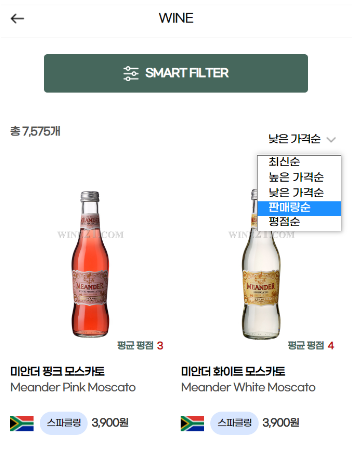

## 💡 서비스 소개

**현대백화점그룹 와인 큐레이션 서비스**

> 현대백화점그룹의 와인웍스를 와인 전문 플랫폼 H-wine에서 만나보세요. 상품 큐레이션부터 픽업, 리뷰 작성, 와인 레스토랑 예약까지 한번에! 
현대백화점그룹의 와인 전문 IT 플랫폼입니다. 

## 🛠️ 기술 스택

 
    
  
   
  
   
   
   
   
  
  
   
  
  
  
    
   

상세 기술스택 및 버전

| 구분 | 기술스택 | 상세 | 버전 |
| --- | --- | --- | --- |
| 공통 | 형상관리 | Github | - |
|  | 이슈관리 | Jira | - |
|  | 커뮤니케이션 | Slack, Confluence, Notion | - |
| Front-end | HTML5 |  | - |
|  | CSS3 |  | - |
|  | JavaScript(ES6) |  | - |
|  | JSP |  | - |
|  | IDE | Eclipse | 1.69.2 |
| Back-end | Java | JDK | 1.8.0_192 |
|  | SpringBoot | springboot | 2.7.8 |
|  |  | Maven | - |
|  |  | JSTL | - |
|  |  | SpringSecurity | - |
|  |  | MyBatis | - |
|  | API관리 | Swagger | 2.9.2 |
|  | 배포 | AWS EC2 | - |
|  | jsonwebtoken |  | 1.1.1 |
|  | DB | Oracle | - |
|  | IDE | Eclipse | - |
|||||

## 🗃️ 프로젝트 구조

### 🏗️ 서비스 구조

## 🔗****Database Modeling****

## 💻 주요 기능 및 데모 영상

### **상품**

- 와인의 국가, 품종, 종류, 당도, 산도 등 총 8가지 필터를 통해 실시간 검색 결과를 확인 가능합니다.
- 최신순, 높은 가격순, 낮은 가격순, 리뷰가 많은 순 등 정렬이 가능합니다.
- 무한 스크롤 기능을 통해 끊김 없이 상품을 조회할 수 있습니다.
- 상품 상세 페이지에서 실시간으로 재고의 변경 상태를 확인할 수 있습니다.
- 사용자가 원하는 와인의 조건을 검색하면 chatGPT를 통해 와인을 추천해줍니다.

### **와인 리뷰 (디캔팅 북) 작성**

- 와인에 대한 리뷰를 구매와 상관 없이 작성할 수 있습니다.
- 와인에 대한 유저들의 리뷰를 종합해 chatGPT가 해당 와인에 대한 한줄평을 작성합니다.

### **회원관리**

- 사용자와 관리자 권한을 부여해 관리자는 백오피스에 접근 가능합니다.

- 내가 쓴 와인 리뷰와 나의 파티 정보, 팔로우 목록을 확인할 수 있습니다.

  

### **장바구니 및 결제**

- 와인을 장바구니에 담을 수 있습니다.
- 와인 재고에 따라 장바구니에 추가할 수 있는 수량이 한정됩니다.
- 시음권을 구매할 수 있습니다.
- 카카오페이/신용카드 결제가 가능합니다.

### **테이블링**

- 와인웍스 (실제 와인 레스토랑) 서울점/대구점 지점 지정 후 좌석을 선택할 수 있습니다.
- 원하는 날짜, 인원, 위치에 좌석 선택 후 예약이 가능합니다.
- 실시간 예약 페이지 동시 접속자 수 확인이 가능합니다. (SSE)
- 마이페이지에서 예약 내역 조회 (취소된 예약, 지난 예약, 다가올 예약 등)가 가능합니다.

## 🗣️ 협업 관리

**Confluence Daily Scrum**

---

**Notion**

## 👩‍👩‍👧 개발 멤버 소개

## 📅 프로젝트 기간

### 23.03.01  ~ 23.04.25 (8주)

- **기획 및 설계** : 23.03.01 ~ 23.03.14
- **프로젝트 구현** : 23.03.14 ~ 23.04.10
- **버그 수정 및 산출물 정리** : 23.04.10 ~ 23.04.20

## 📄 프로젝트 관련 문서

| 구분 | 링크 |
| --- | --- |
| 기능 정의서 | [기능 정의서 보러 가기](https://docs.google.com/spreadsheets/d/1SG_bJGvJPfi2yF6W1LreMpDNPG6bZH_UzkCpi7KKo00/edit?usp=sharing)|
| 발표 자료 | [발표 자료 보러 가기](https://github.com/rohmantique/H-Wine/blob/master/presentation/%EC%95%84%EC%9E%84%ED%99%94%EC%9D%B8_%EB%B0%9C%ED%91%9C%EC%9E%90%EB%A3%8C.pdf) |
